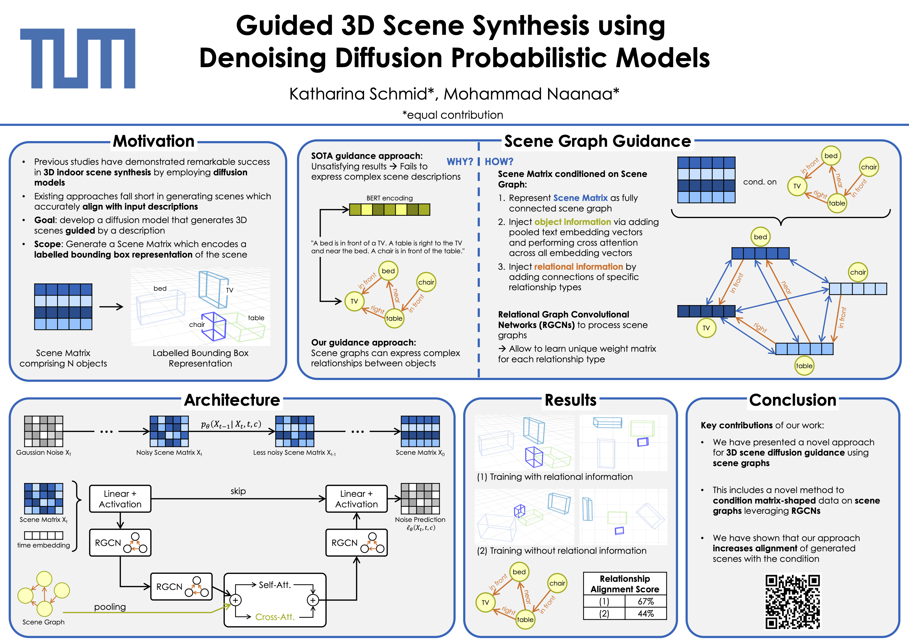
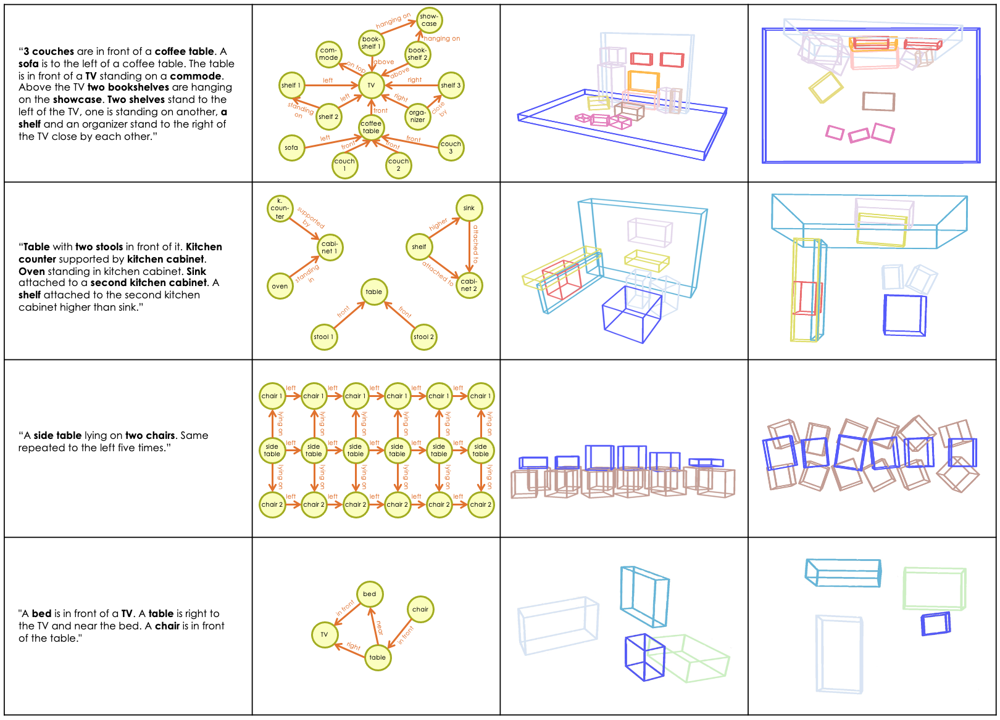

# 3D Scene Diffusion Guidance using Scene Graphs

[Paper (tbd)]() | [arXiv (tbd)]()



This repository contains the source code for the paper **3D Scene Diffusion Guidance using Scene Graphs**.

## Abstract
Guided synthesis of high-quality 3D scenes is a challenging task. Diffusion models have shown promise in generating diverse data, including 3D scenes. However, current methods rely directly on text embeddings for controlling the generation, limiting the incorporation of complex spatial relationships between objects. We propose a novel approach for 3D scene diffusion guidance using scene graphs. To leverage the relative spatial information the scene graphs provide, we make use of relational graph convolutional blocks within our denoising network. We show that our approach significantly improves the alignment between scene description and generated scene.

## Table of Contents
- [Setup](#setup)
- [Usage](#usage)
- [Results](#results)
- [Acknowledgement](#acknowledgement)
- [Citation](#citation)

## Setup
To set up all the necessary dependencies, you can use Conda. Open your terminal and execute the following command:

```
conda env create -f environment.yml
```

## Usage
`guided-diffusion/inference.ipynb` provides a script for generating scenes using the trained denoising network.

`guided-diffusion/main.ipynb` provides a training script for the denoising network.

### [Optional] FastText Embeddings by Facebook Research
We use the [FastText](https://fasttext.cc/) embeddings by Facebook Research to embed the scene objects descriptions in a more robust way than a standard Word2Vec encoder. By using it, we can embed textual description of each object in the scene into a 300-dimensional embedding stored in a node. Combining these nodes with their inter-node relations we generate a scene graph used as input to the denoising network.
You can download the model binary [here](https://dl.fbaipublicfiles.com/fasttext/vectors-crawl/cc.en.300.bin.gz) and place them in the `models` folder.

### [Optional] DVIS Library for 3D Scene Visualization
`guided-diffusion/inference.ipynb` contains a code section on [DVIS library](https://github.com/SirWyver/dvis) usage to visualize the generated scenes in 3D.


## Results
### Generated Scenes
Below is a 4x4 table providing an overview of 3D scene synthesis results. Each row depicts a single result: first column displays a natural language description of a scene, second column shows a corresponding scene graph used as input for the generative process. The remaining two columns depict the synthesized 3D scenes both from the side and top views. The selected results display generative results for (1) very complex, (2) disconnected, (3) repetitive, and (4) simple scene graphs.



### Denoising Process
The following GIF demonstrates the denoising process applied to a single scene:


## Acknowledgement
This work is developed with [TUM Visual Computing Group](http://niessnerlab.org) led by [Prof. Matthias Niessner](https://niessnerlab.org/members/matthias_niessner/profile.html). It builds upon [DiffuScene](https://arxiv.org/abs/2303.14207) and we thank [Yinyu Nie](https://yinyunie.github.io) for his great support and supervision.

## Citation
If you find this work useful please cite:

> tbd
<!-- ```
@misc{
    tbd
}
``` -->